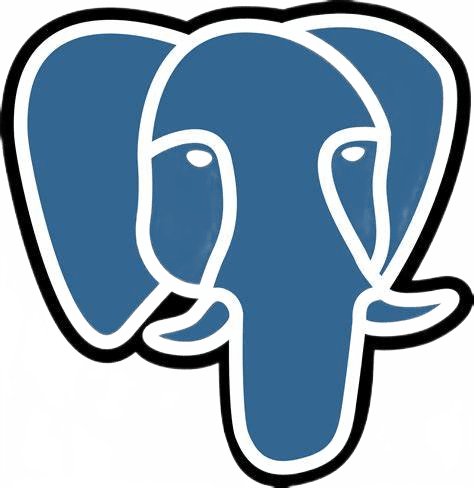

# Rohan P Suresh

<!---->
<!---->
<!-- Working as MERN Stack Dev  at [JitTec Technology Services](http://www.jittec.com). Experimenting on Programming and Linux. Android Enthusiast,Web Dev Self-learning mor. -->

## 𝗠𝘆 𝗧𝗲𝗰𝗸 𝗦𝘁𝗮𝗰𝗸

<table>
  <tbody>
    <tr valign="top">
      <td width="25%" align="center">
        JavaScript   
        
      </td>
      <td width="25%" align="center">
        MongoDB   
        
      </td>
      <td width="25%" align="center">
        𝗚𝗶𝘁   
        
      </td>
       <td width="25%" align="center">
        Python   
        
      </td>        
    </tr>
    <tr valign="top">    
      <td width="25%" align="center">
        PostgreSQL   
        
      </td>
      <td width="25%" align="center">
      <b>React JS   
      </td>
      <td width="25%" align="center">
      <b>Redux   
      </td>
      <td width="25%" align="center">
      <b>Node JS   
      </td>  
    </tr>   
      <tr valign="top">    
      <td width="25%" align="center">
        TypeScript   
        
      </td>
      <td width="25%" align="center">
      <b>Flutter   
      </td>
      <td width="25%" align="center">
      <b>Nest Js   
      </td>
      <td width="25%" align="center">
      <b>MobX   
      </td>  
    </tr>   
  </tbody>
</table>

<!-- 
 -->
<!---->

---

⚠️ Inspired from other Respositories on Github
